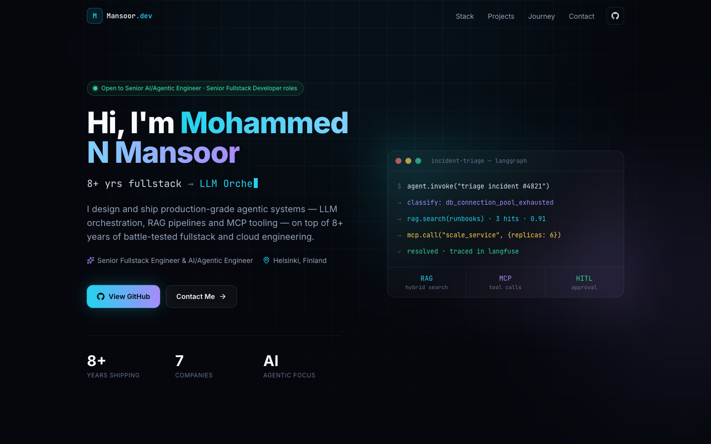

<div align="center">

# Mohammed N Mansoor

**Senior Fullstack Engineer & AI/Agentic Engineer · Helsinki, Finland**

[](https://mnmansour.github.io)
[](https://www.linkedin.com/in/mnmansoor/)

[](https://github.com/MnMansour/MnMansour.github.io/actions/workflows/deploy.yml)


<br />

<a href="https://mnmansour.github.io"></a>

</div>

---

## About

Source code for my personal portfolio. I'm a fullstack engineer with 8+ years of experience across healthcare, fintech, media and enterprise software, and I now focus on **agentic AI systems**: multi-agent orchestration with LangGraph, connecting models to enterprise tooling through MCP, and RAG pipelines backed by vector search.

The site is a fast, fully static single-page app with no backend, deployed to GitHub Pages by GitHub Actions.

## Highlights

- **Dark, developer-focused design** with glowing accents, a subtle grid backdrop and an animated "agent terminal" hero
- **Interactive sections:** filterable tech-stack grid, animated agent-graph architecture diagram, expandable career timeline
- **Accessible and responsive:** semantic HTML, keyboard-friendly controls, mobile menu, and respects `prefers-reduced-motion`
- **Content-driven:** every word on the site lives in one typed data file, `src/data/profile.ts`
- **Lightweight:** no UI framework or animation library; scroll reveals use a small `IntersectionObserver` hook
- **CI/CD:** every push to `main` is type-checked, built and deployed automatically

## Tech stack

| Layer | Tools |
| --- | --- |
| Framework | React 19, TypeScript |
| Styling | Tailwind CSS 3, custom design tokens |
| Build | Vite |
| Icons | lucide-react, inline SVG brand icons |
| Hosting | GitHub Pages via GitHub Actions |

## Getting started

Requires **Node.js 20+**.

```bash
git clone https://github.com/MnMansour/MnMansour.github.io.git
cd MnMansour.github.io
npm install
npm run dev
```

| Script | Description |
| --- | --- |
| `npm run dev` | Start the dev server at `http://localhost:5173` |
| `npm run build` | Type-check and build for production into `dist/` |
| `npm run preview` | Serve the production build locally |

## Project structure

```
src/
├── App.tsx               # Page layout and ambient background
├── data/profile.ts       # All site content (profile, stack, projects, journey)
├── hooks/useReveal.ts    # Scroll-reveal animation hook
└── components/
    ├── ui.tsx            # Section, Reveal and brand icon primitives
    ├── Navbar.tsx        # Sticky nav with active-section tracking
    ├── Hero.tsx          # Intro, typewriter headline, agent terminal
    ├── TechStack.tsx     # Filterable, categorized skills grid
    ├── Projects.tsx      # Featured project and architecture diagram
    ├── Timeline.tsx      # Expandable professional journey
    ├── Contact.tsx       # Contact form and direct links
    └── Footer.tsx
```

Design tokens (colors, fonts, glow shadows, keyframes) live in `tailwind.config.ts`, and shared component classes such as `.card` and `.btn-primary` live in `src/index.css`.

## Deployment

The workflow in [`.github/workflows/deploy.yml`](.github/workflows/deploy.yml) builds the site and publishes `dist/` to GitHub Pages on every push to `main`. Vite uses a relative `base`, so the same build also works on any static host (Cloudflare Pages, Netlify, Vercel) with build command `npm run build` and output directory `dist`.

## Contact

- **Website:** [mnmansour.github.io](https://mnmansour.github.io)
- **LinkedIn:** [linkedin.com/in/mnmansoor](https://www.linkedin.com/in/mnmansoor/)
- **Email:** [mohammednmansoor@gmail.com](mailto:mohammednmansoor@gmail.com)

---

<div align="center">
<sub>© Mohammed N Mansoor. Feel free to use the code as inspiration; please don't republish the personal content as your own.</sub>
</div>
